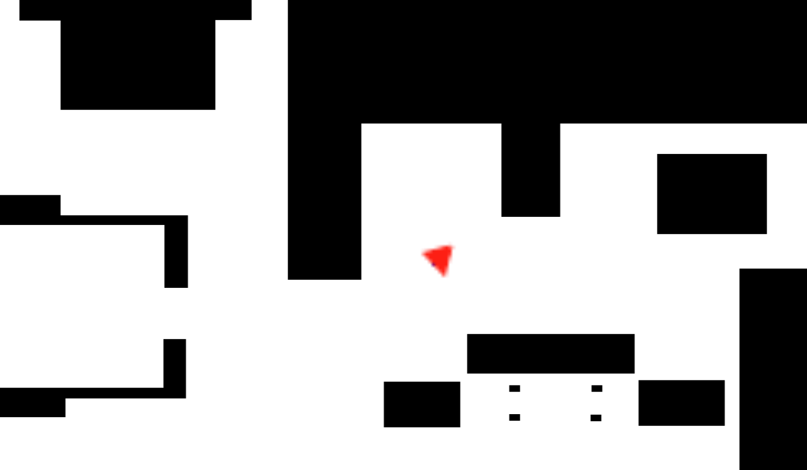
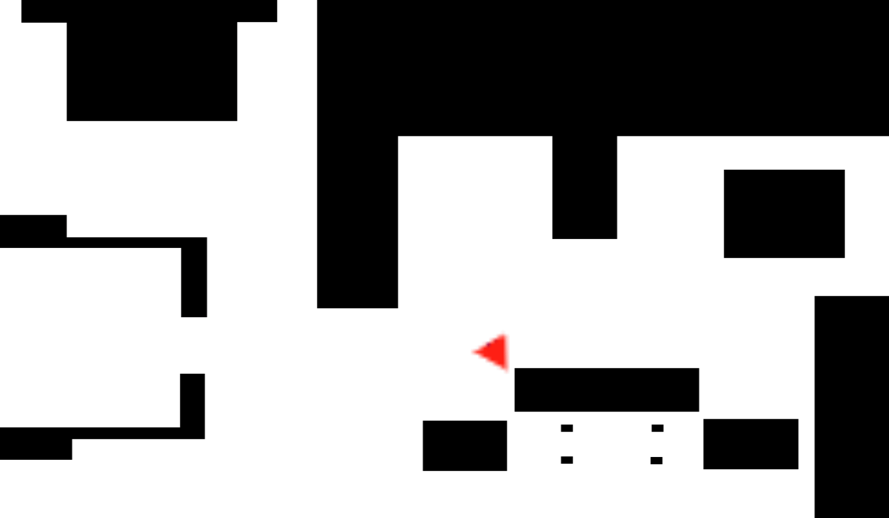

# Primer contacto

Al ser la primera vez escribiendo codigo en python para controlar un robot usando ros, y al no conocer el API, el
primer modelo  que hice fue lo siguiente:

- Va recto hasta que se encuentra un objeto a 1 metro.
- Para, imprime al terminal STOP y sale del programa.



```python
from GUI import GUI
from HAL import HAL

# Enter sequential code!

while True:
    # Enter iterative code!

    print(HAL.getLaserData().values[90])
    if HAL.getLaserData().values[90] > 1 :
        HAL.setV(3)
    else :
      print("STOP")
      HAL.setV(0)
      exit(10)
```

# Implementado maquinas de estado

Para este segundo modelo he creado una máquina de estados sencilla con dos estados: hacia delante y giro.

Por defecto empieza hacia delante y cuando encuentra un objeto delante a menos de 0.5 metros gira durante 3 segundos para luego volver a ir recto.



```python
from GUI import GUI
from HAL import HAL
import datetime

FORWARD=0
TURN=1

current_state = FORWARD

def is_object_near(value):
    return value < 0.5
    
def has_time_finished(start, now):
    after_3_sec = start + datetime.timedelta(seconds = 3)
    return now > after_3_sec

while True:

    if current_state == FORWARD:
        HAL.setV(3)
        HAL.setW(0)
        if is_object_near(HAL.getLaserData().values[90]):
            current_state = TURN
            start_turn = datetime.datetime.now()

    elif current_state == TURN:
        HAL.setV(0)
        HAL.setW(3)
        if has_time_finished(start_turn, datetime.datetime.now()):
          current_state = FORWARD

```