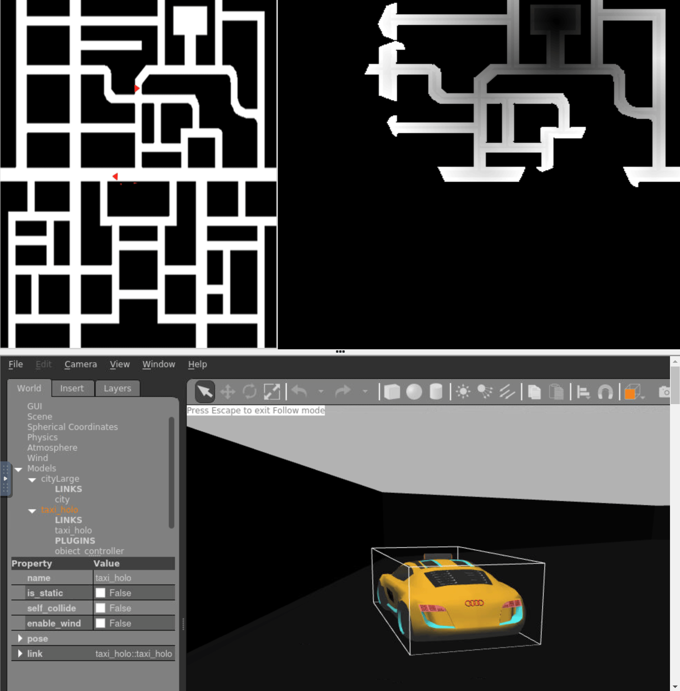
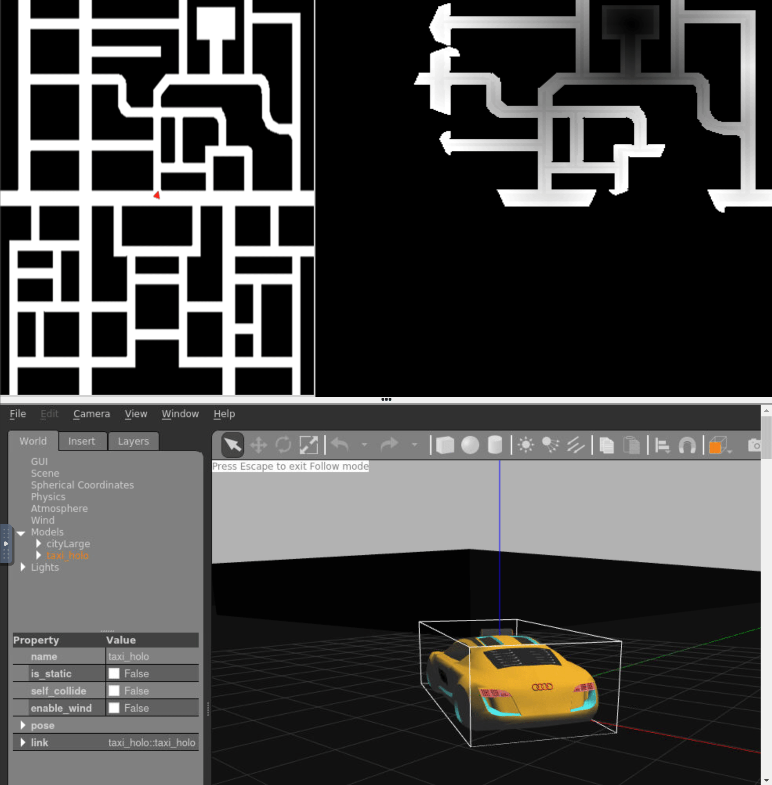

**Disclaimer**: All this test was run using a 13th Gen Intel® Core™ i9-13900HX × 32 and using the version 3.4.24, so the results may vary depending on the build of your system.
So if it crashes it may be due to the lack of power or of a different version of the robotics backend. Videos demostrating the work of the code will only be shown at the end because of the size limit of Github.

The map was created using the gradient path planning algorithm. The approach I used was to use 8 if statements instead of 2 for loops because I kept having problems with the editor, and also it is important to note that I added extra steps for the algorithm after it has found the car in order to be able to turn if needed.

Also another important thing is the need to translate the coordinates from Gazebo to the ones we used for the map.

I did found some problems during this excercise. I'm going to explain them in more detail:

- The angular velocity: in order to get the correct one I needed to transform the car yaw and the postion of the relative minimum point , or the local destination, to the
angle relative to the front of the car. This operations can be seen inside the go_to_target function that controls the navigation part of the excercise.
- The search range: also part of the function mentioned above, having a small search range make the navigation more reactive, or having a wide area of search so that we don't get stuck
in a local minimum. I tried with both approaches but in the end the one that worked the best for me was the last one, because in some intersections the car got stuck and crashed. With this
method, that problem is solved partially, but now another problem arises, as it starts to turn so early now the walls markers need to be expanded a little bit more in order for the car not to crash.
- The thickness of the wall markers: in order for the car to not approach the walls, we add this 'markers' (add higher values to the grid near the walls). In the end the radious around the wall where I placed this markers, with higher values near the wall, was a 5 by 5 square. With this area it solved the issue of the car crashing in the corners and it was small enough to let it pass through the thinner streets.
- The targets: I could not reset the target when it was set.
- The car position: if the car has been move or if it is not in the restart position, Unibotics will tell that the car position is not the correct one, instead it is the one where the car should be if you reseted the excercise. This error causes an strange behavoir during the first execution, and it normally behaves as it should have during the second iteration, but sometimes it does not render the map correctly.

## Firsts versions

I first made the GPP algorithm in normal python, then copy it to Unibotics. So the real problem here was that the car navigation was not correct.

Here is a video that shows the problem, it always goes straight in this example:

And in this one it only spins:

## Works

Here the navigation problem was solved, so now the car reaches the target, that is hardcoded. Now the only thing left was to increase its speed and clean the code.

<video src="../images/middlep4.mp4" controls title="Title"></video>

## Final version

This is the last version with all the problems solved except for the last two ones that could not be solve because it is not part of my code.

So this is a video showing it in action:

<video src="../images/finalp4.mp4" controls title="Title"></video>
