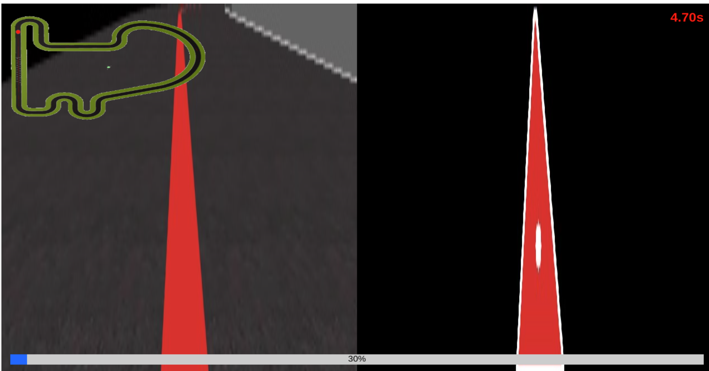

**Disclaimer**: All this test was run using a 13th Gen Intel® Core™ i9-13900HX × 32, so the results may vary depending on the build of your system.
So if it crashes it may be due to the lack of power. Videos demostrating the work of the code will only be shown at the end because of the size limit of Github.

# First attempt

In the beggining of the practice, I tried to get the image and then the red line in the middle so that later I could get the center of the line
to control properly the car. For that I used the functions provided by openCv2, and obtained the red line by applying a red mask over the image.

Then the next step was to find the center of the red line, in this case I used the opencv2 function findContours() to find the contour of the line
and the using moments() I obtained the center of the line.

So the last step remaining to control the car was the PID to calculate the angular velocity. For now I set some parameters so that the car goes slowly but 
can follow the line without an issue.

Also, to properly visualize what the car was seeing, I used "GUI.showImage(np.hstack([image, output]))" to show both the original image and the proccessed one, marking in white the contourn of the red line and the center with a white dot.



With this first approach I manage to get a time of 150 seconds per lap in the Simple circuit.

# Second attempts

In order to try to get lower times I tried to vary the linear speed using the deviation of the car to the line.
If the deviation was notable the car would go slower and if it was almost none it would go faster.

With this method the current lap time drops 15 seconds to a total of 135 in the Simple map.

# Third attempt

In this step, I removed what I added in the last part, but instead I tweaked the PID to achieve a drop of 2 seconds compared to the last step.

So now the lap time is 113 seconds.

# Two PID

As it was almost impossible to reduce the time I changed my approach and started using two PIDs, one for the angular speed, the same as before, and the other for the linear one.

With this approach I hope to be able to reduced the time as it allows me to go faster in the straigths and to slow down when the car is far from the line.

But for now the time increased by two seconds again to 115 seconds.

# Two PID 2

With the same approach as the last step I tweaked the values of both PID's and caused the time to drop 10 seconds.

So using 2 PIDs was correct and in the next parts I will continue to tweak the values of both PID to achieve the 90 seconds mark.

I problem with trying to improve its speed is that the stability of the car decreases, so we would need to find a way to improve it before adding more speed.

The time per lap in the Simple map is 105 seconds.

# Cropped image

Trying to solve the problems with the stability of the car, I tryed to reduce the iteration time per image to get a more responsive system.
For this I cropped the image, reducing the number of iterations neccesary for each time I proccess the image.

The parts of the image that we still use are the ones were the line show except the ones directly in fornt of the car, because the last ones caused the car to react late to curves.

So with this and further tweaking of the PID values the lap time dropped another 8 seconds to 97 seconds per lap.

# Tweaking values

Now the only thing left was to beat the 90 seconds mark and manage to complete the other circuits.

The first part was achieved by continuing with the tweaking of the PIDs and cropping the image further to get a more useful one (giving more value to the future). With this the time dropped by 10 seconds. With that the final time per lap was 87 seconds.

The second one was a bit more tricky. The speed was a problem for the other circuits because they have much tighter curves "chicanes" causing the car to crash. So in order to solve the issue
I need o tweak the PIDs and achieve the balance between speed and control.

# Final car

With further tweaking of the PIDs as explained above, the car managed to complete all the circuits and the 90 seconds time of the Simple one.

An important thing to take notice is that it is not possible to perfectly control the car to follow the line 100% of the time and that in some tighter turns the car may not follow the line but it will recover very quickly.

Next I leave the videos of the circuits (instead of having the line highlighted in white it is in green). **Note to read the disclaimer** because this results may vary a lot deppending on the machine or the load of it. It may cause some crashes in Montmelo and Montreal chicanes.

Also to note that the times are higher than normal because of the recording for the video. So the times are about 5 - 10 seconds higher.

Simple circuit with a time of 96 seconds in the video:
<video src="../images/SimpleFinal.mp4" controls title="Title"></video>

Montmelo circuit with a time of 147 seconds:
<video src="../images/Montmelo.mov" controls title="Title"></video>
The main problems with this circuit were the chicane and the previous turn. In both of them the car would randomly crash because it didn't recognize the turn in time.

Nürburgring circuit with a time of 123 second:
<video src="../images/Nurburring.mp4" controls title="Title"></video>
Note that this circuit can also be done at a much higher speed because of the lack of a tight chicane.

Montreal circuit with a time of 257 seconds:
<video src="../images/Montreal.mp4" controls title="Title"></video>
The main issue with this circuit is that because it is the largest it causes the performnce to drop significantly (low performance increases the proccessing time of the image, reducing rensponseness). This is the reason why the car oscilates a lot during this video.

# Extra: 70 seconds lap in Simple circuit

When I was trying to make the car complete the circuits I managed to get a minimum time of 70 second in the Simple circuit. This is not really the fastest possible time, but it was the fastest time while following more or less the line.

Modifying the PID to achieve more top speed at the straights and a little more at the curves:

```python
pid = PID(-320,320,-1,1)
pid.setPid(0.45,0,2.95)
pid2 = PID(0,320,0,9)
pid2.setPid(0.9,0.2,10)
``` 

The problem with this PID is that it only works in this circuit, in the rest it crashes in the tight corners.
<video src="../images/SimpleFast.mp4" controls title="Title"></video>