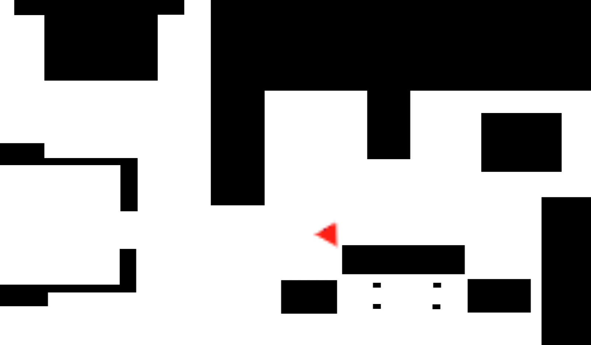

# Firsts attempts

Because this was my first time writting code to controle a robot using this API, I decided to start with a very simple approach:

- It goes forward until it detects an object less than 1 meter in front.
- Then it stops printing STOP to the terminal and it ends.

# Creating a Finite State Machine

For this second model I decided to create a simple FSM with only 2 states: forward and turn.

By default it starts going forward until it detects an obstacle less than 0.5 meters in front and then turns for 3 seconds.

# Using randomness and spirals

In this model I decided to use a more complex finite state machine (FSM), with the addition of one more state, the spiral.

Also, I added in this model some randomness when choosing wich direction to rotate.

# Final Model

In this final model I used a 4 states FSM, being each one:

- Forward: go forward until it detects and object.
- Turn: rotates until it does not detect and object or if 5s passed then goes to stuck state
- Spiral: do a spiral until it detects and object or finishes in 10 seconds
- Stuck: go backward 1 second and then go to turn

In this model I added some randomness with the selection of the next state when it finishes Turn succesfully,
being the chances to go Forward 20% and 80% to go to Spiral.

Here is some footage of this model working:

And here is the highest score I obtained using it (Your score may vary because of the added randomness):

I also noticed some issues with the chairs in the simulation, causing the vacuum to get stuck forever between them.